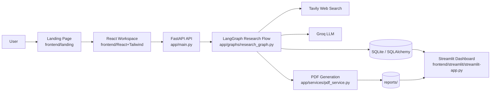

# InsightSwarm

<div align="center">


<h3>An autonomous multi-agent research engine for academic and market intelligence</h3>

<p><em>Turn fragmented information into structured, decision-ready reports with planning, retrieval, synthesis, verification, and PDF delivery.</em></p>

</div>

## ✨ What InsightSwarm does

InsightSwarm combines multiple specialized agents into a research workflow that can:

- orchestrate topic planning, web retrieval, synthesis, and verification
- generate polished report artifacts as markdown and PDF
- expose a web-based workspace for submitting research topics and reviewing results
- track research activity through a lightweight Streamlit dashboard
- run as a full-stack local or containerized experience

## 🧠 Architecture overview



## 🧩 Core components

| Area | Purpose | Key files |
| --- | --- | --- |
| Backend API | Receives research requests, tracks runs, and exposes report downloads | [app/main.py](app/main.py), [app/api/routes.py](app/api/routes.py) |
| Research engine | Coordinates planning, search, verification, and synthesis | [app/graphs/research_graph.py](app/graphs/research_graph.py) |
| Database layer | Provides async SQLAlchemy sessions and persistence | [app/db/database.py](app/db/database.py) |
| PDF export | Converts final markdown into downloadable PDFs | [app/services/pdf_service.py](app/services/pdf_service.py) |
| React workspace | Handles topic submission and report viewing | [frontend/React+Tailwind/src](frontend/React%2BTailwind/src) |
| Landing page | Serves the public-facing entry experience | [frontend/landing](frontend/landing) |
| Streamlit dashboard | Displays activity history and research metadata | [frontend/streamlit/streamlit-app.py](frontend/streamlit/streamlit-app.py) |

## 🛠 Tech stack

- Python 3.13+
- FastAPI
- LangGraph
- LangChain + Groq
- Tavily search
- SQLAlchemy + SQLite
- WeasyPrint
- React 19 + React Router
- Tailwind CSS 4
- Framer Motion
- Streamlit
- Docker / Docker Compose

## 📁 Repository layout

```text
.
├── app/                  # FastAPI backend, graph, services, database, and models
├── frontend/
│   ├── landing/          # Static marketing and entry page
│   ├── React+Tailwind/   # Research workspace UI
│   └── streamlit/        # Activity dashboard
├── devops/               # Dockerfiles and Docker Compose setup
├── reports/              # Generated PDF reports
├── logs/                 # Runtime logs
├── tests/                # Test directory (currently empty)
└── pyproject.toml        # Python project metadata
```

## ⚙️ Prerequisites

- Python 3.13 or newer
- Node.js 18+ and npm
- `uv` for Python dependency management
- Optional: Docker Desktop and Docker Compose

## 🔐 Environment variables

Create a `.env` file in the project root. A full example is available in [.env.example](.env.example).

| Variable | Purpose |
| --- | --- |
| `GROQ_API_KEY` | Required for the LLM used in the research graph |
| `TAVILY_API_KEY` | Required for web search retrieval |
| `LLM_MODEL` | Optional Groq model name |
| `DATABASE_URL` | Optional database connection string; defaults to SQLite |
| `REPORT_DIR` | Directory for generated PDF files |
| `TAVILY_MAX_RESULTS` | Maximum search results per query |
| `TAVILY_TOPIC` | Tavily topic setting |
| `TAVILY_SEARCH_DEPTH` | Tavily search depth |
| `LOG_LEVEL` | Logging verbosity |

Minimal example:

```env
GROQ_API_KEY=your_groq_api_key
TAVILY_API_KEY=your_tavily_api_key
DATABASE_URL=sqlite+aiosqlite:///research_app.db
REPORT_DIR=reports
```

## ▶️ Local setup

### 1) Backend

Install dependencies and start the API:

```bash
uv sync
uv run uvicorn app.main:app --reload --host 127.0.0.1 --port 8000
```

Useful backend URLs:

- API: `http://127.0.0.1:8000`
- Health check: `http://127.0.0.1:8000/health`
- Swagger docs: `http://127.0.0.1:8000/docs`

### 2) React research workspace

```bash
cd frontend/React+Tailwind
npm install
npm run dev
```

The workspace is designed to talk to the backend at `http://127.0.0.1:8000/api`.

### 3) Landing page

```bash
cd frontend/landing
npm install
npm run dev
```

The landing page runs on port `3001`.

### 4) Streamlit dashboard

```bash
uv run streamlit run frontend/streamlit/streamlit-app.py --server.port 8501 --server.address 0.0.0.0
```

The dashboard reads research activity and report metadata from the backend.

## 🐳 Docker setup

Start the full stack with Docker Compose:

```bash
docker compose -f devops/docker-compose.yml up --build
```

This launches:

- Landing page on `http://localhost:3001`
- React workspace on `http://localhost:5173`
- FastAPI backend on `http://localhost:8000`
- Streamlit dashboard on `http://localhost:8501`

To stop everything:

```bash
docker compose -f devops/docker-compose.yml down
```

## 🔗 API overview

| Method | Endpoint | Description |
| --- | --- | --- |
| `GET` | `/health` | Health check |
| `POST` | `/api/research` | Start a new research run |
| `GET` | `/api/research` | List research runs |
| `GET` | `/api/research/{run_id}` | Get run status |
| `GET` | `/api/research/{run_id}/report` | Fetch report metadata |
| `GET` | `/api/research/{run_id}/download` | Download or preview the PDF |

## 🔄 How it works

1. A user submits a topic in the React workspace.
2. The FastAPI backend creates a research run and starts a background LangGraph workflow.
3. The graph plans sub-questions, searches the web with Tavily, synthesizes the findings, and verifies the output.
4. The final markdown report is cleaned, stored, and rendered to PDF.
5. The React report page polls the backend until the report is ready, then displays the final document and download link.
6. The Streamlit dashboard provides a lightweight view of activity and history.

## 📝 Notes

- Generated reports and logs are persisted in `reports/` and `logs/`.
- The repository currently does not include automated tests under `tests/`.
- PDF generation uses WeasyPrint, so local environments may need the platform-specific system libraries required by that package.

## 🤝 Contributing

If you extend the project, keep the README aligned with the actual run commands, ports, and environment variables. That matters here because the repository contains multiple user-facing apps in one workspace.
