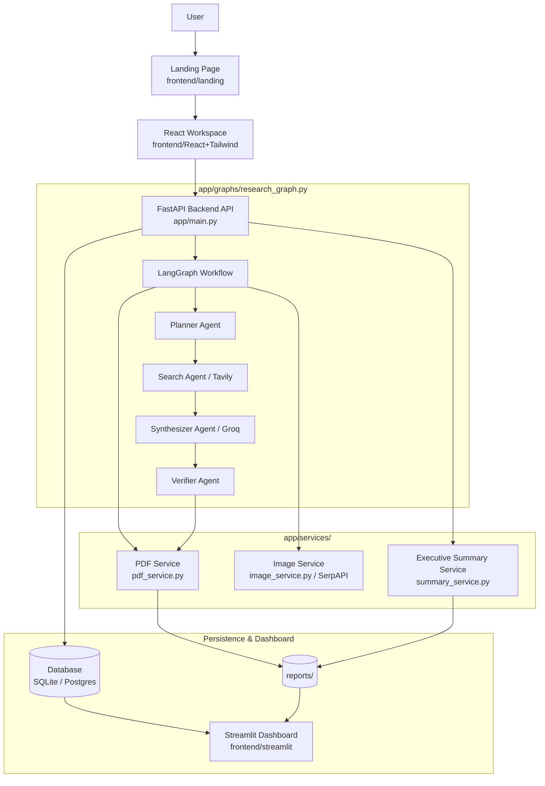

# InsightSwarm

<div align="center">


<h3>An autonomous multi-agent research engine for academic and market intelligence</h3>

<p><em>Turn fragmented information into structured, publication-ready reports with AI planning, multi-source retrieval, chart generation, image enrichment, executive summaries, and PDF export.</em></p>

</div>

## ✨ What InsightSwarm does

InsightSwarm combines specialized AI agents into a coordinated research workflow that can:

- **Orchestrate Research Pipelines**: Decompose user topics into targeted sub-queries, execute web searches via Tavily, synthesize deep analytical content, and run hallucination verification checks.
- **Generate Publication-Quality PDFs**: Render multi-page consulting-style reports complete with cover pages, automatic Table of Contents with dotted leaders, KPI dashboard grids, and formatted references.
- **Produce Dynamic Data Visualizations**: Convert LLM chart schemas into native embedded charts (Bar, Donut, Line, Area charts) using Pygal/Matplotlib.
- **Enrich Content with Images**: Automatically fetch and insert relevant web images into reports via SerpAPI with automatic image cleanup.
- **Generate AI Executive Summaries**: Create concise standalone executive summaries with dedicated PDF export options.
- **Expose Interactive Workspaces**: Provide a modern React web workspace for research submission, live progress tracking, and report management (downloading & deleting runs).
- **Track System Analytics**: Monitor activity, report counts, and metadata using an integrated Streamlit dashboard.
- **Containerized & Production Ready**: Run locally with `uv` and `npm`, or as a full containerized stack via Docker Compose.

## 🧠 Architecture overview


```mermaid
flowchart TD
  U[User] --> L[Landing Page<br/>frontend/landing]
  L --> R[React Workspace<br/>frontend/React+Tailwind]
  R --> A[FastAPI Backend API<br/>app/main.py]
  
  subgraph Research Engine [app/graphs/research_graph.py]
    A --> G[LangGraph Workflow]
    G --> P[Planner Agent]
    P --> S[Search Agent / Tavily]
    S --> Syn[Synthesizer Agent / Groq]
    Syn --> V[Verifier Agent]
  end

  subgraph Services [app/services/]
    G --> PDF[PDF Service<br/>pdf_service.py]
    G --> IMG[Image Service<br/>image_service.py / SerpAPI]
    A --> SUM[Executive Summary Service<br/>summary_service.py]
  end

  subgraph Persistence & Dashboard
    A --> D[(Database<br/>SQLite / Postgres)]
    PDF --> F[(reports/)]
    SUM --> F
    D --> SD[Streamlit Dashboard<br/>frontend/streamlit]
    F --> SD
  end

  V --> PDF
```

## 🧩 Core components

| Area | Purpose | Key files |
| --- | --- | --- |
| **Backend API** | Handles research job submissions, report retrieval, summary generation, and run deletions | [app/main.py](app/main.py), [app/api/routes.py](app/api/routes.py) |
| **Research engine** | Coordinates intake, sub-question planning, search retrieval, synthesis, and fact verification | [app/graphs/research_graph.py](app/graphs/research_graph.py) |
| **PDF export service** | Compiles markdown, KPI dashboards, Pygal charts, and images into styled PDFs via WeasyPrint | [app/services/pdf_service.py](app/services/pdf_service.py) |
| **Image search service** | Fetches relevant web images via SerpAPI and handles temporary file cleanup | [app/services/image_service.py](app/services/image_service.py) |
| **Executive summary service** | Generates condensed executive summaries and standalone PDFs from completed reports | [app/services/summary_service.py](app/services/summary_service.py) |
| **Database layer** | Provides async SQLAlchemy database sessions, models, and schemas | [app/db/database.py](app/db/database.py), [app/models/](app/models/) |
| **React workspace** | Modern UI for submitting topics, viewing interactive reports, downloading PDFs, and deleting runs | [frontend/React+Tailwind/src](frontend/React%2BTailwind/src) |
| **Landing page** | Marketing entry page introducing platform features | [frontend/landing](frontend/landing) |
| **Streamlit dashboard** | Light analytical dashboard for monitoring research runs and system logs | [frontend/streamlit/streamlit-app.py](frontend/streamlit/streamlit-app.py) |

## 🛠 Tech stack

- **Core / Backend**: Python 3.13+, FastAPI, Uvicorn, Pydantic v2
- **Agentic Workflow**: LangGraph, LangChain, Groq LLM (`llama-3.1-8b-instant`)
- **Search & Media**: Tavily API (web search), SerpAPI (image retrieval)
- **Database & ORM**: SQLAlchemy (Async), SQLite / PostgreSQL (`aiosqlite`, `psycopg2-binary`)
- **PDF & Visuals**: WeasyPrint, Jinja2, Pygal, Pillow, Markdown
- **Frontend Workspace**: React 19, React Router v7, Tailwind CSS v4, Framer Motion, Lucide Icons, Vite
- **Metrics Dashboard**: Streamlit
- **DevOps & Tooling**: `uv` (package management), Docker, Docker Compose

## 📁 Repository layout

```text
.
├── app/                  # FastAPI backend, LangGraph workflow, services, models
│   ├── api/              # API routes and dependency injection
│   ├── core/             # App logging configuration and settings
│   ├── db/               # Async SQLAlchemy database engine and session
│   ├── graphs/           # LangGraph research graph (planner, search, synthesizer, verifier)
│   ├── models/           # Database models and Pydantic request/response schemas
│   └── services/         # PDF rendering, image download/cleanup, executive summary generator
├── frontend/
│   ├── landing/          # Public-facing landing page (React + Tailwind)
│   ├── React+Tailwind/   # Main research submission & report viewing workspace
│   └── streamlit/        # Streamlit analytics dashboard
├── devops/               # Dockerfiles and Docker Compose configuration
├── reports/              # Storage directory for generated PDF reports and summaries
├── logs/                 # Application runtime logs
├── deploy.md             # Free-tier deployment guide (Render, Neon, Vercel/Cloudflare)
└── pyproject.toml        # Python dependencies and project configuration
```

## ⚙️ Prerequisites

- **Python 3.13+**
- **Node.js 18+** and **npm**
- **`uv`** for fast Python dependency management (`pip install uv` or via installer)
- **System Libraries for WeasyPrint**: Pango, Cairo, and GDK-PixBuf (required for local PDF generation; pre-installed in Docker setup)
- *Optional*: Docker Desktop & Docker Compose

## 🔐 Environment variables

Create a `.env` file in the project root. Refer to [.env.example](.env.example) for a complete template.

| Variable | Required | Purpose |
| --- | --- | --- |
| `GROQ_API_KEY` | **Yes** | API key for Groq LLM inference |
| `TAVILY_API_KEY` | **Yes** | API key for Tavily web search retrieval |
| `SERPAPI_API_KEY` | Optional | API key for Google Image search via SerpAPI in generated reports |
| `LLM_MODEL` | Optional | Groq model selection (default: `llama-3.1-8b-instant`) |
| `DATABASE_URL` | Optional | Database connection URL (default: `sqlite+aiosqlite:///research_app.db`) |
| `REPORT_DIR` | Optional | Output folder for PDF files (default: `reports`) |
| `TAVILY_MAX_RESULTS` | Optional | Max search results per sub-query (default: `3`) |
| `TAVILY_TOPIC` | Optional | Tavily topic type (default: `general`) |
| `TAVILY_SEARCH_DEPTH` | Optional | Tavily search depth (`basic` or `advanced`) |
| `LOG_LEVEL` | Optional | Logging level (`INFO`, `DEBUG`, `WARNING`, `ERROR`) |
| `LANGSMITH_TRACING` | Optional | Set to `true` to enable LangChain / LangSmith tracing |
| `LANGSMITH_API_KEY` | Optional | API key for LangSmith observability |

Minimal `.env` setup:

```env
GROQ_API_KEY=your_groq_api_key
TAVILY_API_KEY=your_tavily_api_key
SERPAPI_API_KEY=your_serpapi_key
DATABASE_URL=sqlite+aiosqlite:///research_app.db
REPORT_DIR=reports
```

## ▶️ Local setup

### 1) Backend API

Install Python dependencies and launch the server:

```bash
uv sync
uv run uvicorn app.main:app --reload --host 127.0.0.1 --port 8000
```

Useful backend endpoints:

- **API Base**: `http://127.0.0.1:8000`
- **Health Check**: `http://127.0.0.1:8000/health`
- **Swagger OpenAPI Docs**: `http://127.0.0.1:8000/docs`

### 2) React Research Workspace

```bash
cd frontend/React+Tailwind
npm install
npm run dev
```

The workspace opens at `http://localhost:5173` and communicates with the backend API on port `8000`.

### 3) Landing Page

```bash
cd frontend/landing
npm install
npm run dev
```

The landing page runs on `http://localhost:3001`.

### 4) Streamlit Dashboard

```bash
uv run streamlit run frontend/streamlit/streamlit-app.py --server.port 8501 --server.address 0.0.0.0
```

Access the dashboard at `http://localhost:8501`.

## 🐳 Docker setup

Run the complete multi-container stack with Docker Compose:

```bash
docker compose -f devops/docker-compose.yml up --build
```

Services exposed:

- **Landing Page**: `http://localhost:3001`
- **React Workspace**: `http://localhost:5173`
- **FastAPI Backend**: `http://localhost:8000`
- **Streamlit Dashboard**: `http://localhost:8501`

To stop the containers:

```bash
docker compose -f devops/docker-compose.yml down
```

## 🔗 API overview

| Method | Endpoint | Description |
| --- | --- | --- |
| `GET` | `/health` | Server health check endpoint |
| `POST` | `/api/research` | Submit a new research topic and start background workflow |
| `GET` | `/api/research` | List all historical research runs with metadata |
| `GET` | `/api/research/{run_id}` | Check status and progress of a research run |
| `GET` | `/api/research/{run_id}/report` | Retrieve completed report metadata and raw markdown |
| `GET` | `/api/research/{run_id}/download` | Download or inline-preview the generated PDF report |
| `POST` | `/api/research/{run_id}/executive-summary` | Generate an AI executive summary for a report |
| `GET` | `/api/research/{run_id}/executive-summary/download` | Download or preview the Executive Summary PDF |
| `DELETE` | `/api/research/{run_id}/delete` | Delete a research run, report, and stored PDF assets |

## 🔄 How it works

1. **Submission**: User submits a topic and research instructions in the React workspace.
2. **Background Run Creation**: FastAPI creates a database record and launches a background LangGraph agent loop.
3. **Planner & Search**: The **Planner** breaks down the prompt into sub-questions. The **Searcher** queries Tavily for web sources.
4. **Synthesis & Charts**: The **Synthesizer** drafts the report, generating KPI metrics, tabular data, JSON chart definitions, and image search queries.
5. **Verification**: The **Verifier** inspects the draft against retrieved sources for accuracy before final rendering.
6. **PDF & Image Generation**: Markdown is compiled into HTML. Embedded charts are rendered using Pygal/Matplotlib, images are downloaded via SerpAPI (and cleaned up), and WeasyPrint generates the PDF document.
7. **Delivery & Executive Summary**: The frontend displays the report, renders live interactive components, supports downloading PDFs, and enables one-click Executive Summary generation.

## 🚀 Deployment

For instructions on deploying InsightSwarm to free-tier cloud platforms (Render for Backend, Neon for PostgreSQL, Vercel/Cloudflare Pages for Frontend), view [deploy.md](deploy.md).

## 📝 Notes

- PDF output files are stored in `reports/`, and application runtime logs are stored in `logs/`.
- Temporary image files downloaded during PDF rendering are stored in `app/temp_images/` and automatically cleaned up after use.
- Ensure system GTK/Pango dependencies are available locally if running WeasyPrint without Docker.

## 🤝 Contributing

Contributions and feature suggestions are welcome! Please ensure any changes keep `README.md`, environment configuration templates, and API endpoints up to date.
